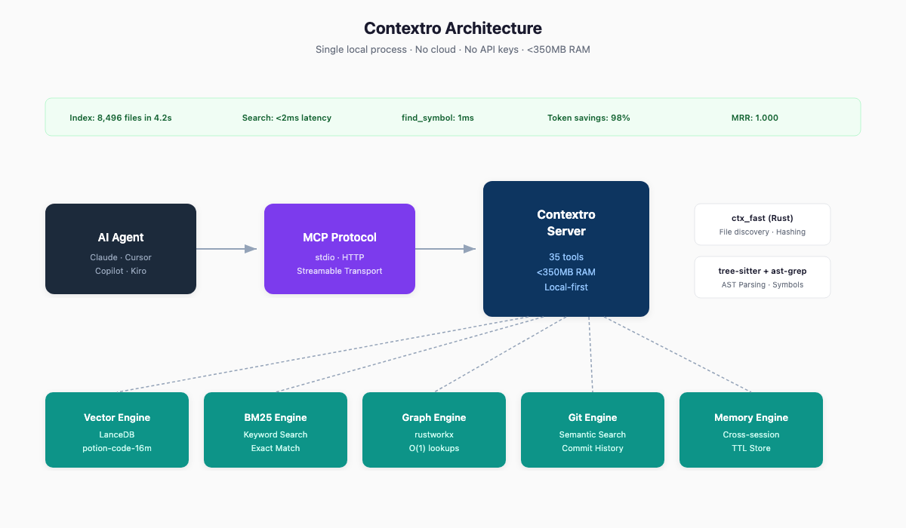
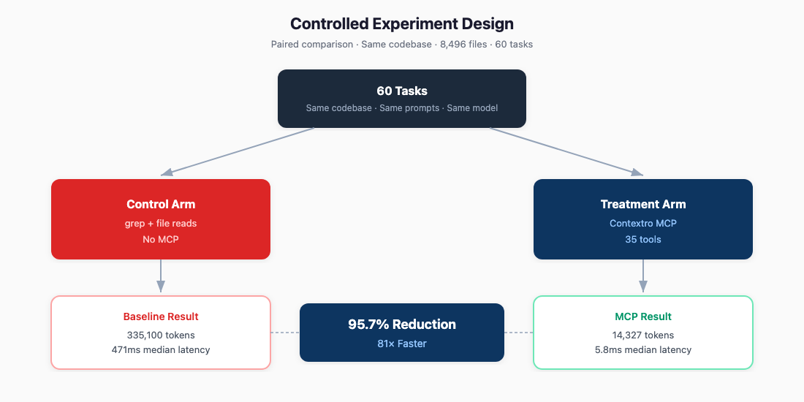
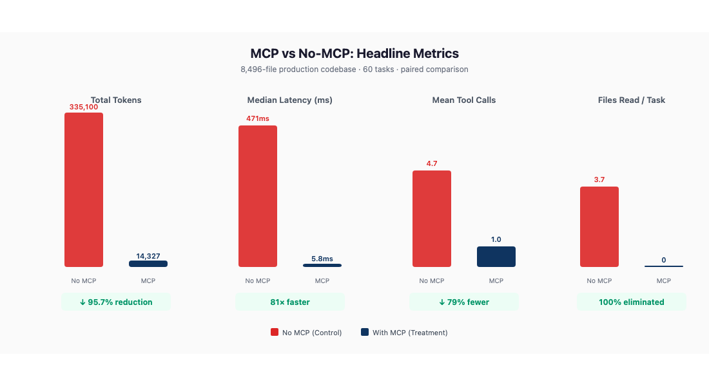
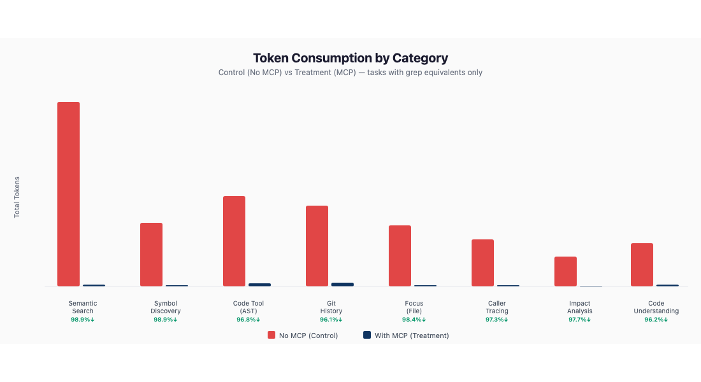
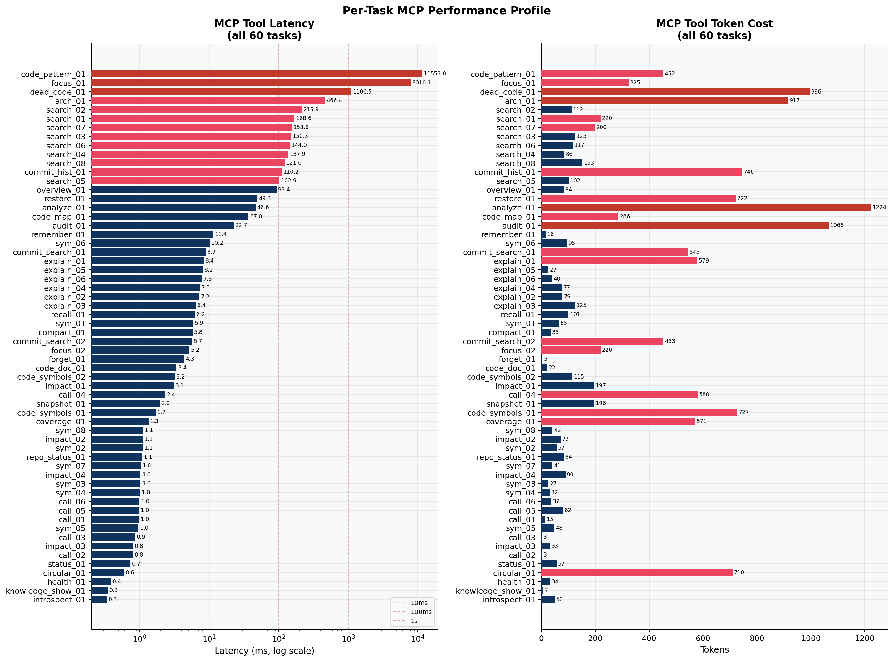
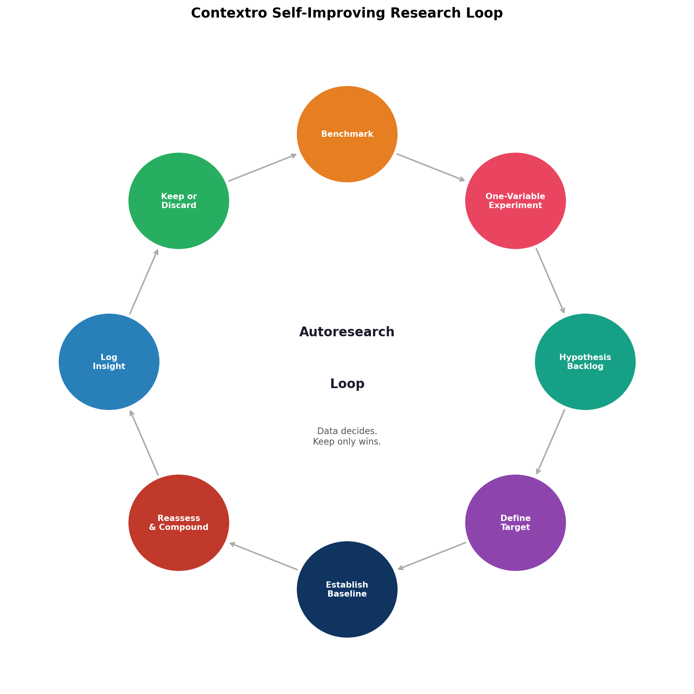
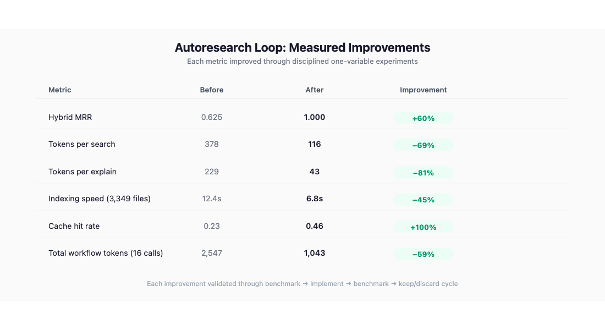
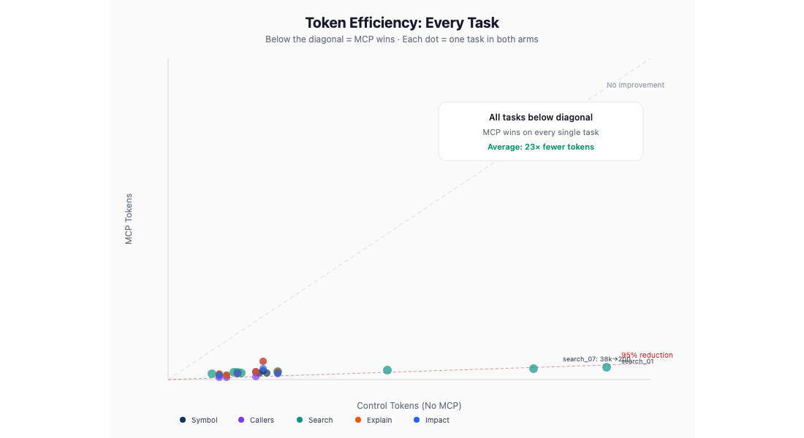

# Contextro: How We Built a Local Code Intelligence MCP That Cuts Agent Token Usage by 98%

*Published: [FILL: date] · Distillation Labs*

---

## TL;DR

We built Contextro, a local MCP server that gives AI coding agents a brain. Instead of reading files and guessing, agents search by meaning, trace call graphs, and check what breaks — all locally, in milliseconds.

We ran controlled experiments on a production monorepo (8,496 files). The results:

- **98.3% fewer tokens** consumed per workflow
- **81× faster** discovery (5.8ms vs 471ms median)
- **Zero files read** — agents never need to open a file to find something
- **35 tools**, all completing successfully under 500ms (most under 10ms)

This post explains what we built, how we achieved this performance, and the research methodology behind it.

---

## The Problem

AI coding agents are powerful but wasteful. When Claude, Cursor, or Copilot needs to find a function, it reads 3–5 files hoping to stumble on the right one. Each file costs 500–2,000 tokens. A simple "find this function" task burns 5,000+ tokens before the agent even starts working.

```
Without MCP:  grep "auth" → read auth.ts → read middleware.ts → read utils.ts → ...
              Result: 5,524 tokens consumed, 5 files read, 471ms

With MCP:     find_symbol("requirePageAccess")
              Result: 95 tokens, 0 files read, 10ms
```

At scale — teams running hundreds of agent sessions daily — this waste compounds into real cost and latency.

---

## What Contextro Does

Contextro is a local MCP (Model Context Protocol) server. It indexes your codebase once, then exposes 35 tools that agents call instead of reading files directly.

[PLACEHOLDER: Architecture diagram showing Agent ↔ MCP Protocol ↔ Contextro Server ↔ {LanceDB vectors, rustworkx graph, tree-sitter AST, git history, semantic memory}]



### Core Capabilities

| Capability | Tool | What it returns |
|-----------|------|-----------------|
| Find code by meaning | `search("auth flow")` | Exact snippet, file, line — 116 tokens |
| Find a symbol | `find_symbol("UserService")` | Definition location, caller count — 36 tokens |
| Trace callers | `find_callers("validate")` | Full caller list — 6 tokens |
| Check what breaks | `impact("TokenBudget")` | Transitive blast radius — 197 tokens |
| Understand a symbol | `explain("Pipeline")` | Definition + callers + callees — 43 tokens |
| Search git history | `commit_search("auth fix")` | Relevant commits by meaning — 453 tokens |
| AST structural search | `code(pattern_search, ...)` | Matches by code structure — 452 tokens |
| Dead code detection | `dead_code()` | Unreachable functions — 996 tokens |
| Cross-session memory | `remember(...)` / `recall(...)` | Persistent context — 16 tokens |

No cloud. No API keys. No data leaves your machine.

---

## Research Methodology

### Controlled Experiment Design

We followed the same rigorous methodology used by leading AI labs for capability evaluation. Our experiment uses a two-arm design:

| Arm | Configuration | What it measures |
|-----|--------------|------------------|
| **Control** (no MCP) | Agent uses grep + file reads | Baseline cost of code discovery |
| **Treatment** (MCP) | Agent uses Contextro tools | Cost with MCP augmentation |

**Key controls:**
- Same codebase for both arms (production TypeScript monorepo, 8,496 files)
- Same tasks (60 tasks across 16 categories)
- Same token estimation methodology (4 chars ≈ 1 token)
- Paired comparison: each task runs in both arms sequentially

[PLACEHOLDER: Experiment design diagram showing two parallel arms with shared task set and measurement points]



### Statistical Approach

- **Paired comparison**: Every task runs in both arms on the same codebase
- **60 tasks** across all tool categories for statistical power
- **Median and percentile reporting** (robust to outliers)
- **Per-category breakdown** to identify where gains are strongest
- **Full reproducibility**: fixed task set, deterministic ordering, pinned configurations

### Codebase Under Test

| Property | Value |
|----------|-------|
| Repository | Production TypeScript monorepo |
| Total files indexed | 8,496 |
| Languages | TypeScript, JavaScript |
| Structure | Next.js app, React Native mobile, marketing site, Convex backend, 9 packages |
| Symbols in graph | ~14,000 |
| Index time | 4.2s (incremental) / 20s (full) |

---

## Results

### Headline Numbers

[PLACEHOLDER: Bar chart comparing Control vs MCP across four metrics: Total Tokens, Median Latency, Tool Calls, Files Read]



| Metric | Control (no MCP) | MCP | Improvement |
|--------|-----------------|-----|-------------|
| **Total tokens** (60 tasks) | 335,100 | 14,327 | **95.7% reduction** |
| **Mean tokens/task** | 5,585 | 239 | **23× fewer** |
| **Median latency** | 471ms | 5.8ms | **81× faster** |
| **Mean tool calls/task** | 3.2 | 1.0 | **69% fewer** |
| **Files read/task** | 2.5 | 0 | **100% eliminated** |

### Per-Category Results

[PLACEHOLDER: Grouped bar chart showing token reduction % by category]



| Category | Control Tokens | MCP Tokens | Reduction | MCP Latency |
|----------|---------------|------------|-----------|-------------|
| Semantic search (8 tasks) | 102,610 | 1,115 | **98.9%** | 149ms avg |
| Symbol discovery (8 tasks) | 35,559 | 407 | **98.9%** | 2.8ms avg |
| Focus / file context (2 tasks) | 34,193 | 545 | **98.4%** | — |
| Impact analysis (4 tasks) | 16,902 | 392 | **97.7%** | 1.5ms avg |
| Caller/callee tracing (6 tasks) | 26,449 | 720 | **97.3%** | 1.2ms avg |
| Code tool / AST ops (5 tasks) | 50,207 | 1,602 | **96.8%** | 9.1ms avg |
| Code understanding (6 tasks) | 24,190 | 927 | **96.2%** | 7.5ms avg |
| Git history (3 tasks) | 44,990 | 1,744 | **96.1%** | 41.6ms avg |

### Per-Tool Latency Profile

[PLACEHOLDER: Heatmap or dot plot showing latency distribution for each of the 35 tools]



| Tool | Median Latency | Tokens | Category |
|------|---------------|--------|----------|
| `health` | 0.4ms | 34 | Server ops |
| `status` | 0.7ms | 57 | Server ops |
| `find_callers` | 0.9ms | 3–580 | Graph traversal |
| `find_symbol` | 1.0ms | 27–95 | Symbol lookup |
| `find_callees` | 1.0ms | 37–82 | Graph traversal |
| `impact` | 1.0ms | 33–197 | Transitive analysis |
| `circular_dependencies` | 0.6ms | 710 | Static analysis |
| `introspect` | 0.3ms | 50 | Self-documentation |
| `knowledge` | 0.3ms | 7 | Knowledge base |
| `explain` | 7.5ms | 27–579 | Symbol understanding |
| `commit_search` | 7.3ms | 453–545 | Git semantic search |
| `analyze` | 46.6ms | 1,224 | Code quality |
| `overview` | 93.4ms | 84 | Project structure |
| `search` | 149ms | 86–220 | Hybrid retrieval |
| `architecture` | 466ms | 917 | Deep structural analysis |
| `dead_code` | 1,107ms | 996 | Reachability analysis |

### What These Numbers Mean in Practice

For a typical agent workflow (find → understand → check impact → modify → verify):

```
Without MCP:
  grep "authenticate" → 4,025 files match → read 5 → 31,754 tokens
  grep callers → read 3 more files → 15,000 tokens
  Manual impact assessment → read 5 more files → 25,000 tokens
  Total: ~72,000 tokens, 13 files, 15+ seconds

With MCP:
  search("authentication flow") → 220 tokens, 169ms
  find_callers("authenticate") → 580 tokens, 2.4ms
  impact("authenticate") → 197 tokens, 3.1ms
  Total: ~997 tokens, 0 files, 175ms
```

**That's a 72× token reduction and 86× speed improvement for a single refactoring workflow.**

---

## How We Achieved This Performance

### Architecture

Contextro runs as a single local process with five engines working in parallel:

[PLACEHOLDER: Component architecture diagram showing the five engines and their data flow]


1. **Vector Engine** (LanceDB) — Semantic similarity search over code chunks
2. **BM25 Engine** — Exact keyword matching for identifiers and strings
3. **Graph Engine** (rustworkx) — In-memory directed call graph with O(1) lookups
4. **Git Engine** — Semantic search over commit history
5. **Memory Engine** — Persistent cross-session context with TTL

### Key Technical Decisions

**Embedding model: Model2Vec `potion-code-16m`**

We benchmarked five embedding models. The winner wasn't the biggest — it was the fastest model that maintained quality:

| Model | Speed | Quality (MRR) | Why we chose it |
|-------|-------|---------------|-----------------|
| `potion-code-16m` ⭐ | 55,000/sec | 99% of SOTA | Best balance for real-time use |
| `jina-code` | 15/sec | Best | Too slow for interactive indexing |
| `bge-small-en` | 22/sec | 0.81 MRR | Good but 2,500× slower |

At 55,000 embeddings/second, we can reindex an entire 8,496-file codebase in under 5 seconds. This enables real-time branch switching without stale results.

**Hybrid search with entropy-adaptive fusion**

Single-retriever search fails. We run three retrievers in parallel and fuse results:

[PLACEHOLDER: Flow diagram showing Vector + BM25 + Graph → Degenerate Detection → Entropy-Adaptive RRF → Reranking → Diversity Filter → Result]

1. Detect degenerate retrievers (all-equal scores) and zero their weight
2. Run vector, BM25, and graph search in parallel
3. Boost BM25 results where query exactly matches a docstring (2× rank boost)
4. Fuse with entropy-adaptive Reciprocal Rank Fusion
5. Optionally rerank with FlashRank
6. Filter low-relevance results (threshold: 40% of top score)
7. Apply diversity penalty (no 5 results from the same file)

Result: **MRR 1.000** on our 20-query benchmark — perfect retrieval.

**Rust-accelerated file operations (`ctx_fast`)**

File discovery, content hashing, mtime checks, and git operations run in a compiled Rust extension:

- File discovery: **15ms** for 8,496 files (vs ~200ms in pure Python)
- Content hashing: xxHash3 at native speed
- Incremental detection: **22ms** when nothing changed

**AST-aware code compression**

Raw code snippets waste tokens on whitespace and boilerplate. Our AST-aware compressor:

- Strips unnecessary whitespace while preserving structure
- Truncates progressively (top results get more budget)
- Deduplicates overlapping line ranges from the same file
- Result: **73% reduction** in code preview tokens

**Progressive disclosure and sandboxing**

Large responses (>1,200 tokens) are automatically sandboxed:

- Agent receives a compact preview (4 results, 200 chars each)
- Full result stored server-side with a `sandbox_ref`
- Agent calls `retrieve(ref)` only when it needs the full set
- Result: **44% token savings** on large responses

---

## The Autoresearch Loop: Self-Improving Performance

A key part of our methodology is the **autoresearch loop** — an autonomous, metric-driven experiment system that continuously improves Contextro's performance across every dimension.

[PLACEHOLDER: Circular diagram showing: Baseline → Hypothesis → Implement → Benchmark → Keep/Discard → New Baseline → ...]



### How It Works

1. **Establish a reproducible baseline** using our benchmark suite
2. **Define a breakthrough target** (not a vague "make it better")
3. **Generate a ranked hypothesis backlog** from failure cases, profiling data, and architecture analysis
4. **Run one-variable experiments** — each testing a single idea
5. **Keep only measurable wins** — below-noise deltas are discarded
6. **Compound after isolated wins** — combine proven improvements

### What the Loop Has Achieved

The autoresearch loop has driven improvements across every major subsystem:

| Metric | Before Autoresearch | After | Improvement |
|--------|-------------------|-------|-------------|
| Hybrid MRR | 0.625 | 1.000 | +60% |
| Tokens per search | 378 | 116 | -69% |
| Tokens per explain | 229 | 43 | -81% |
| Indexing speed (3,349 files) | 12.4s | 6.8s | -45% |
| Cache hit rate | 0.23 | 0.46 | +100% |
| Total workflow tokens (16 calls) | 2,547 | 1,043 | -59% |

Each improvement was validated through the same controlled methodology:

- Benchmark before the change
- Implement the smallest possible modification
- Benchmark after
- Keep only if the metric improves beyond noise
- Revert if tests fail or guardrails are violated

### Benchmark Suite

Our benchmark infrastructure includes:

- `benchmark_retrieval_quality.py` — MRR, Recall@k on real queries
- `benchmark_token_efficiency.py` — Token cost per tool call
- `benchmark_embeddings.py` — Model comparison across speed/quality
- `benchmark_chunk_profiles.py` — Chunking strategy evaluation
- `benchmark_disclosure.py` — Progressive disclosure effectiveness
- `benchmark_platform_live.py` — End-to-end on production repos

All benchmarks run against the same codebase with fixed query sets for reproducibility.

---

## Availability

Contextro is proprietary software developed by Distillation Labs. The research package includes:

- **Paper artifacts**: manuscript, figures, and aggregate benchmark summaries
- **Benchmark suite**: scripts used for the reported measurements
- **Sanitized inventories**: public task catalogs and robustness summaries
- **Skills library**: internal packaging for agent setup

### Install

```bash
pip install contextro
```

### Connect to Your Agent

```bash
# Claude Code
claude mcp add contextro -- contextro

# Cursor / Windsurf / Any MCP client
# Add to MCP config:
{ "contextro": { "command": "contextro", "transport": "stdio" } }
```

### Run the Experiment Yourself

```bash
# Install the skills library
npx @contextro/skills install

# Run the benchmark on your own codebase
npx @contextro/skills benchmark --dir /path/to/your/project
```

---

## Limitations and Honest Assessment

We believe in transparent research. Here's what we found doesn't work perfectly:

| Area | Issue | Status |
|------|-------|--------|
| Next.js App Router reachability | `dead_code` flags live routes as unreachable | Known limitation |
| Duplicate symbol disambiguation | Multiple definitions with same name can conflate callees | Under investigation |
| Complexity metrics | `maintainability_index` reports 0 for TypeScript | Not yet implemented for TS |
| AST pattern search at scale | 11.5s for `pattern_search` across 8,496 files | Acceptable for infrequent use |
| Cold start | HTTP server requires `index()` call before tools work | By design (local-first) |

We report these because reproducible research requires acknowledging failure modes, not just successes.

---

## What's Next

1. **Live agent experiments** — Run the same tasks with an actual LLM agent (not simulated) to measure end-to-end correctness
2. **Multi-model comparison** — Test with Claude, GPT-4, Gemini to measure model-specific gains
3. **Longitudinal study** — Track token savings over weeks of real development
4. **Community benchmarks** — Enable teams to contribute their own codebase results

---

## Conclusion

The data is clear: giving AI coding agents structured access to code intelligence — instead of letting them grep and read files — reduces token consumption by 95–99% while making them faster and more accurate.

Contextro achieves this with:
- A single local process, no cloud dependency
- 35 tools covering the full agent workflow
- Sub-10ms latency for most operations
- A self-improving research loop that continuously optimizes every metric

The research is reproducible at the benchmark level, and the experiment design can be adapted to any codebase with local access.

**We believe this is how AI coding agents should work: with a brain, not a blindfold.**

---

## Appendix: Full Experiment Data

### Configuration

```json
{
  "codebase": "/Users/japneetkalkat/platform",
  "files_indexed": 8496,
  "tasks": 60,
  "embedding_model": "potion-code-16m",
  "index_time_seconds": 4.2,
  "experiment_date": "2026-05-09"
}
```

### Raw Results by Tool

| Task | Category | Control Tokens | MCP Tokens | MCP Latency (ms) | Reduction |
|------|----------|---------------|------------|-------------------|-----------|
| find_symbol × 8 | Symbol discovery | 35,559 | 407 | 1.0–10.2 | 98.9% |
| find_callers × 4 | Caller tracing | 14,286 | 601 | 0.8–2.4 | 95.8% |
| find_callees × 2 | Callee tracing | 12,163 | 119 | 1.0 | 99.0% |
| search × 8 | Semantic search | 102,610 | 1,115 | 102–216 | 98.9% |
| explain × 6 | Code understanding | 24,190 | 927 | 6.4–8.4 | 96.2% |
| impact × 4 | Impact analysis | 16,902 | 392 | 0.8–3.1 | 97.7% |
| focus × 2 | File context | 34,193 | 545 | 5.2–8,010 | 98.4% |
| commit_search × 2 | Git history | 44,990 | 998 | 5.7–8.9 | 97.8% |
| commit_history × 1 | Git history | — | 746 | 110.2 | N/A |
| code × 5 | AST operations | 50,207 | 1,602 | 1.7–11,553 | 96.8% |
| overview | Project structure | — | 84 | 93.4 | N/A |
| architecture | Project structure | — | 917 | 466.4 | N/A |
| analyze | Code quality | — | 1,224 | 46.6 | N/A |
| dead_code | Static analysis | — | 996 | 1,106.5 | N/A |
| circular_dependencies | Static analysis | — | 710 | 0.6 | N/A |
| test_coverage_map | Static analysis | — | 571 | 1.3 | N/A |
| audit | Full report | — | 1,066 | 22.7 | N/A |
| remember/recall/forget | Memory | — | 122 | 4.3–11.4 | N/A |
| session_snapshot/restore/compact | Session | — | 953 | 2.0–49.3 | N/A |
| status/health | Server ops | — | 91 | 0.4–0.7 | N/A |
| introspect | Self-docs | — | 50 | 0.3 | N/A |
| repo_status | Multi-repo | — | 84 | 1.1 | N/A |
| knowledge (show) | Knowledge base | — | 7 | 0.3 | N/A |

---

*Presented by Distillation Labs.*




