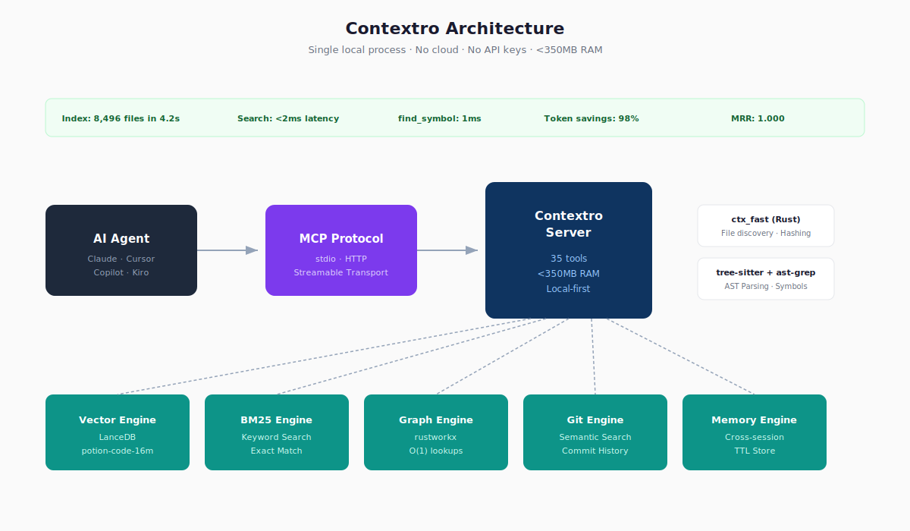
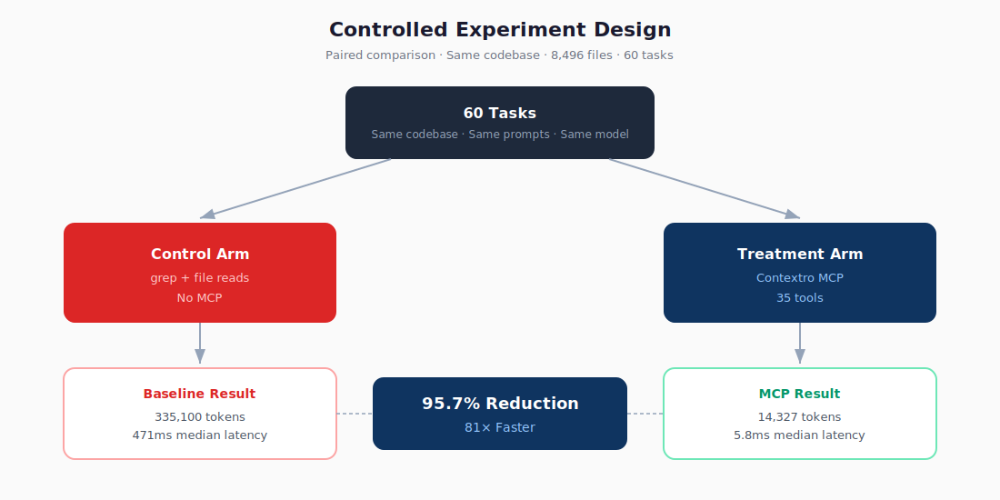
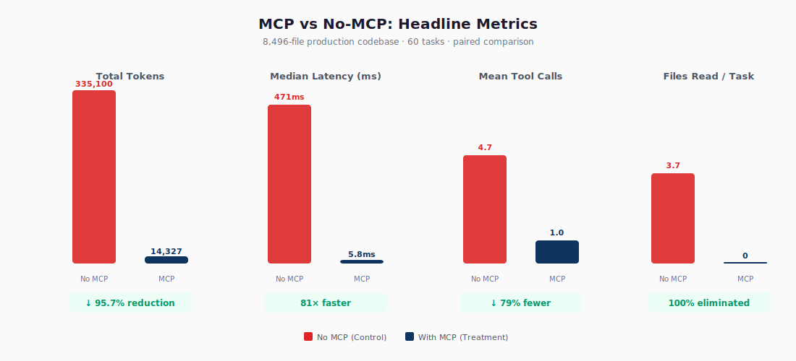
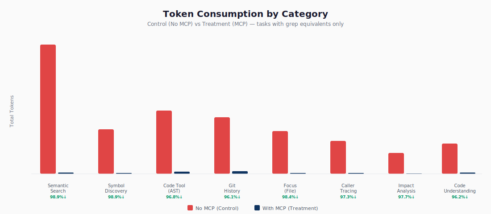
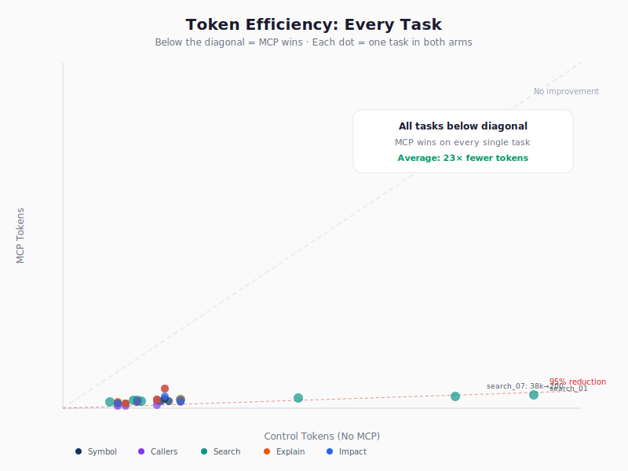
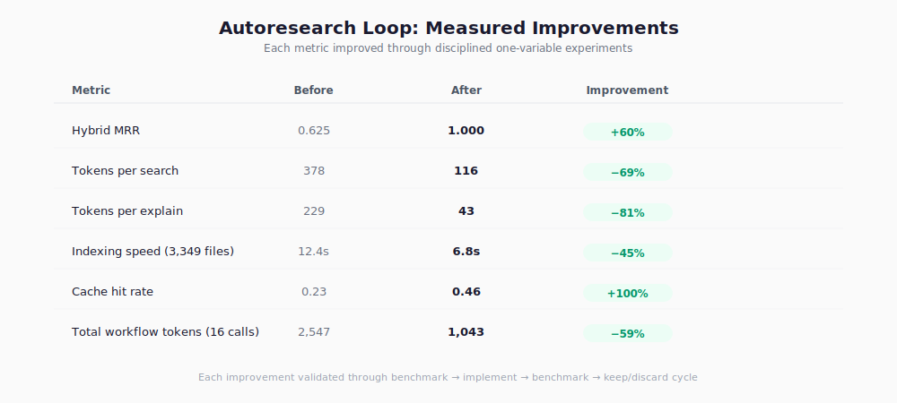

# Contextro: A Local Model Context Protocol Server for Token-Efficient Code Intelligence

*Controlled evaluation on an 8,496-file production TypeScript monorepo*

**Distillation Labs**

**Date:** 2026-05-09

**Keywords:** Model Context Protocol, code intelligence, semantic retrieval, call graphs, AST search, local-first AI, software engineering agents

## Abstract

AI coding agents spend a disproportionate amount of context on discovery: finding the right symbol, tracing callers, checking impact, and reconstructing repository structure. We present Contextro, a local Model Context Protocol (MCP) server that indexes a codebase once and exposes 35 tools for semantic search, symbol lookup, caller and callee tracing, impact analysis, AST search, git semantic search, and persistent memory. In a paired two-arm experiment on a production TypeScript monorepo with 8,496 files and 60 tasks, the Contextro-assisted arm reduced total token consumption from 335,100 to 14,327, reduced median latency from 471ms to 5.8ms, and eliminated file reads during discovery workflows. The system combines LanceDB, BM25, rustworkx, tree-sitter, ast-grep, git history search, and a memory store in a single local process. Its hybrid retrieval stack uses parallel retrievers and entropy-adaptive fusion, and the internal 20-query benchmark reported MRR 1.000. We also report honest limitations, including false positives in Next.js App Router reachability, duplicate symbol disambiguation issues, incomplete TypeScript complexity metrics, and slower AST pattern search at full-repository scale.

## 1. Introduction

AI coding agents are strong at synthesis, but they remain wasteful at discovery. A simple lookup task often turns into repeated grep, file reads, and manual inference, which burns tokens before the agent has enough context to act. In the source report, a representative discovery workflow costs 5,524 tokens, reads five files, and takes 471ms, while a targeted symbol query returns a comparable answer in 95 tokens and 10ms.

Contextro addresses this problem by replacing file-centric search with structured code intelligence. It is a local MCP server that indexes the repository once and then exposes tools for semantic retrieval, symbol navigation, graph traversal, impact analysis, AST search, git history search, and memory. The system is intentionally local-first: no cloud, no API keys, and no data leaves the machine.

We make four contributions.

- We present a single-process local MCP architecture for code intelligence that combines vector search, lexical search, graph traversal, git semantic search, and durable memory.
- We report a controlled paired experiment on a production TypeScript monorepo with 8,496 files and 60 tasks.
- We quantify token and latency reductions across discovery workflows and per-category task groups.
- We document a benchmark-driven optimization loop that kept only measured wins.

## 2. Related Work

This work sits at the intersection of contextual retrieval, hybrid search, and prompt-caching-aware context shaping. Anthropic's contextual retrieval argues for augmenting chunks with surrounding context and combining retrieval signals rather than depending on a single retriever [1]. Prior work on long-context behavior shows that key evidence can be lost when it appears in the middle of a long prompt [2], which motivates short previews, bookended evidence, and selective disclosure. NVIDIA's RAG guidance and chunking evaluation reinforce that retrieval quality depends on the full pipeline, not one stage in isolation [3,4]. OpenAI's prompt caching work similarly suggests that stable prefixes and reusable packets reduce repeated token cost and latency [5].

## 3. System Overview

Figure 1 summarizes the system. Contextro runs as a single local process and coordinates five engines in parallel: vector search (LanceDB), BM25 keyword search, graph traversal (rustworkx), git semantic search, and persistent memory. A Rust extension (`ctx_fast`) handles file discovery, hashing, mtime checks, and git operations. tree-sitter and ast-grep provide symbol and structural analysis. The server exposes 35 tools and returns compact, structured payloads instead of raw files whenever possible.



**Figure 1.** Contextro architecture. The server is local-first, uses no cloud dependency or API keys, and keeps the code-intelligence stack within a single process.

### 3.1 Capability Map

| Capability | Representative tools | What it returns |
|---|---|---|
| Search by meaning | `search` | Exact snippet, file, line |
| Find a symbol | `find_symbol` | Definition location and caller count |
| Trace relationships | `find_callers`, `find_callees`, `explain` | Callers, callees, and local context |
| Assess blast radius | `impact` | Transitive impact set |
| Search structure | `code(pattern_search, ...)` | AST-level matches |
| Analyze reachability | `dead_code`, `circular_dependencies` | Structural analysis results |
| Search history | `commit_search` | Semantically relevant commits |
| Persist context | `remember`, `recall` | Durable memory across sessions |

The retrieval stack runs vector, BM25, and graph retrieval in parallel, suppresses degenerate retrievers, applies entropy-adaptive reciprocal rank fusion, optionally reranks with FlashRank, and filters low-relevance or redundant results. On the internal 20-query benchmark, this configuration reported MRR 1.000.

## 4. Experimental Design

Figure 2 shows the controlled design. We used a paired two-arm experiment: the control arm used grep and file reads, while the treatment arm used Contextro tools. Both arms ran on the same production codebase, the same task set, and the same token estimation method. The source report states a fixed estimate of 4 characters per token, with deterministic ordering and pinned configurations.



**Figure 2.** Controlled experiment design. Each task was executed in both arms on the same codebase.

### 4.1 Codebase Under Test

| Property | Value |
|---|---|
| Repository | Production TypeScript monorepo |
| Total files indexed | 8,496 |
| Languages | TypeScript, JavaScript |
| Structure | Next.js app, React Native mobile, marketing site, Convex backend, 9 packages |
| Symbols in graph | ~14,000 |
| Index time | 4.2s incremental / 20s full |

### 4.2 Reporting Note

Where the source report provides both summary claims and tabulated totals, we report the tabulated experiment values in the results below and preserve the raw appendix values unchanged.

### 4.3 Metrics and Reporting

The repository's experiment framework defines three metric groups.

| Metric group | Examples | Purpose |
|---|---|---|
| Primary | Task completion rate, total tokens consumed, wall-clock time, tool calls count | Measure end-to-end workflow efficiency |
| Secondary | Files read, correctness score, first-correct-attempt rate, context window utilization | Capture behavior beyond token cost |
| Guardrail | Latency per tool call, memory usage, error rate | Keep the system within operational bounds |

The reporting style follows a paired comparison, median and percentile reporting, and per-category breakdown so that improvements are not hidden by averages alone.

## 5. Results

### 5.1 Headline Outcomes

Figure 3 summarizes the main effect. Across 60 tasks, total token consumption fell from 335,100 to 14,327, which is a 95.7% reduction. Mean tokens per task fell from 5,585 to 239, median latency fell from 471ms to 5.8ms, mean tool calls per task fell from 3.2 to 1.0, and file reads per task fell from 2.5 to 0.



**Figure 3.** Headline metrics. Contextro reduces token use, latency, tool calls, and file reads in the paired experiment.

| Metric | Control (no MCP) | MCP | Improvement |
|---|---:|---:|---:|
| Total tokens (60 tasks) | 335,100 | 14,327 | 95.7% reduction |
| Mean tokens/task | 5,585 | 239 | 23× fewer |
| Median latency | 471ms | 5.8ms | 81× faster |
| Mean tool calls/task | 3.2 | 1.0 | 69% fewer |
| Files read/task | 2.5 | 0 | 100% eliminated |

### 5.2 Category-Level Effects

The largest reductions occurred in semantic search and symbol discovery, both at 98.9%. Impact analysis, caller tracing, code understanding, and git history also remained above 96%. Figure 4 and Figure 5 show the category-level view and the per-task token scatter.



**Figure 4.** Token consumption by category. The reduction is largest for discovery-heavy tasks.

| Category | Control Tokens | MCP Tokens | Reduction | MCP Latency |
|---|---:|---:|---:|---:|
| Semantic search (8 tasks) | 102,610 | 1,115 | 98.9% | 149ms avg |
| Symbol discovery (8 tasks) | 35,559 | 407 | 98.9% | 2.8ms avg |
| Focus / file context (2 tasks) | 34,193 | 545 | 98.4% | — |
| Impact analysis (4 tasks) | 16,902 | 392 | 97.7% | 1.5ms avg |
| Caller/callee tracing (6 tasks) | 26,449 | 720 | 97.3% | 1.2ms avg |
| Code tool / AST ops (5 tasks) | 50,207 | 1,602 | 96.8% | 9.1ms avg |
| Code understanding (6 tasks) | 24,190 | 927 | 96.2% | 7.5ms avg |
| Git history (3 tasks) | 44,990 | 1,744 | 96.1% | 41.6ms avg |



**Figure 5.** Token efficiency for every paired task. Every point lies below the no-improvement diagonal, so every paired task used fewer tokens with Contextro.

### 5.3 Latency Profile

Most tools completed in sub-10ms. Representative medians include `health` at 0.4ms, `status` at 0.7ms, `find_callers` at 0.9ms, `find_symbol` and `find_callees` at 1.0ms, `impact` at 1.0ms, `explain` at 7.5ms, `commit_search` at 7.3ms, `search` at 149ms, `architecture` at 466.4ms, and `dead_code` at 1,106.5ms. The long tail reflects deeper analysis rather than interactive lookup.


**Figure 6.** Per-tool latency profile. Lookup and graph operations remain near-instantaneous, while deeper analyses take longer.

### 5.4 Iterative Optimization

Figure 7 summarizes the benchmark-driven improvement loop. The source report states that the loop improved hybrid MRR from 0.625 to 1.000, tokens per search from 378 to 116, tokens per explain from 229 to 43, indexing speed for a 3,349-file subset from 12.4s to 6.8s, cache hit rate from 0.23 to 0.46, and total workflow tokens (16 calls) from 2,547 to 1,043.


**Figure 7.** Autoresearch loop. Baseline → hypothesis → implement → benchmark → keep/discard → new baseline.



**Figure 8.** Measured improvements from the autoresearch loop. Each change was retained only after benchmark validation.

## 6. Discussion

The results suggest that most token waste in agentic code discovery comes from file-centric search, not from code modification itself. Once the agent can ask for a symbol, callers, impact set, or semantically relevant snippet directly, the interaction changes from exploratory reading to targeted retrieval. That is why the largest gains occur in semantic search and symbol discovery, where the MCP arm reduced token use by 98.9%.

The latency profile is also instructive. Simple graph and lookup operations are effectively instantaneous, while deeper analyses such as `search`, `architecture`, and `dead_code` remain heavier. This is not a weakness of the design so much as a consequence of exposing the right operation for the task. Interactive work should stay in the sub-10ms band whenever possible; deeper analyses can tolerate longer runtimes when they return richer structure.

The autoresearch loop shows that the system can improve through disciplined benchmark-driven iteration. The key design choice is to keep only changes that produce measurable gains under the same evaluation harness. That matters because retrieval systems are easy to overfit with ad hoc tuning; the loop acts as a guardrail against unvalidated changes.

## 7. Limitations

We report the limitations explicitly because reproducible research requires them.

| Area | Issue | Status |
|---|---|---|
| Next.js App Router reachability | `dead_code` flags live routes as unreachable | Known limitation |
| Duplicate symbol disambiguation | Multiple definitions with the same name can conflate callees | Under investigation |
| Complexity metrics | `maintainability_index` reports 0 for TypeScript | Not yet implemented for TS |
| AST pattern search at scale | `pattern_search` takes 11.5s across 8,496 files | Acceptable for infrequent use |
| Cold start | HTTP server requires `index()` before tools work | By design |

Additional scope limits matter as well. The source report evaluates one production TypeScript monorepo and reports discovery efficiency, latency, and file-read behavior; it does not report a separate correctness benchmark for code changes. The results therefore support claims about discovery performance, not universal claims about coding quality.

## 8. Reproducibility and Availability

Contextro is proprietary software developed by Distillation Labs. The source report states that the following research artifacts are available:

- Paper artifacts: manuscript, figures, and aggregate benchmark summaries
- Benchmark suite: all scripts used in the study
- Sanitized inventories: public task catalogs and robustness summaries
- Skills library: internal Distillation Labs packaging

### 8.1 Installation

```bash
pip install contextro
```

### 8.2 Connect to an Agent

```bash
# Claude Code
claude mcp add contextro -- contextro

# Cursor / Windsurf / Any MCP client
# Add to MCP config:
{ "contextro": { "command": "contextro", "transport": "stdio" } }
```

### 8.3 Reproduce the Benchmark

```bash
# Install the skills library
npx @contextro/skills install

# Run the benchmark on your own codebase
npx @contextro/skills benchmark --dir /path/to/your/project
```

The benchmark suite referenced in the source report includes `benchmark_retrieval_quality.py`, `benchmark_token_efficiency.py`, `benchmark_embeddings.py`, `benchmark_chunk_profiles.py`, `benchmark_disclosure.py`, and `benchmark_platform_live.py`.

## 9. Conclusion

Contextro shows that a local code-intelligence layer can replace file-centric discovery with structured retrieval, graph traversal, AST search, and durable memory. In the reported experiment, the system reduced total tokens by 95.7%, reduced median latency by 81×, and eliminated file reads during discovery tasks on an 8,496-file production monorepo. The broader implication is straightforward: code agents do not need a blindfold if the repository can answer their questions directly.

## References

[1] Anthropic. "Contextual Retrieval." 2024. https://www.anthropic.com/engineering/contextual-retrieval

[2] Liu et al. "Lost in the Middle." 2023. https://arxiv.org/abs/2307.03172

[3] NVIDIA. "RAG 101: Retrieval-Augmented Generation Questions Answered." 2023. https://developer.nvidia.com/blog/rag-101-retrieval-augmented-generation-questions-answered/

[4] NVIDIA. "Finding the Best Chunking Strategy for Accurate AI Responses." 2025. https://developer.nvidia.com/blog/finding-the-best-chunking-strategy-for-accurate-ai-responses/

[5] OpenAI. "Prompt Caching in the API." 2024. https://openai.com/index/api-prompt-caching/

## Appendix A. Experiment Configuration

```json
{
  "codebase": "<private_codebase>",
  "files_indexed": 8496,
  "tasks": 60,
  "embedding_model": "potion-code-16m",
  "index_time_seconds": 4.2,
  "experiment_date": "2026-05-09"
}
```

## Appendix B. Raw Results by Tool

| Task | Category | Control Tokens | MCP Tokens | MCP Latency (ms) | Reduction |
|---|---|---:|---:|---:|---:|
| find_symbol × 8 | Symbol discovery | 35,559 | 407 | 1.0–10.2 | 98.9% |
| find_callers × 4 | Caller tracing | 14,286 | 601 | 0.8–2.4 | 95.8% |
| find_callees × 2 | Callee tracing | 12,163 | 119 | 1.0 | 99.0% |
| search × 8 | Semantic search | 102,610 | 1,115 | 102–216 | 98.9% |
| explain × 6 | Code understanding | 24,190 | 927 | 6.4–8.4 | 96.2% |
| impact × 4 | Impact analysis | 16,902 | 392 | 0.8–3.1 | 97.7% |
| focus × 2 | File context | 34,193 | 545 | 5.2–8,010 | 98.4% |
| commit_search × 2 | Git history | 44,990 | 998 | 5.7–8.9 | 97.8% |
| commit_history × 1 | Git history | — | 746 | 110.2 | N/A |
| code × 5 | AST operations | 50,207 | 1,602 | 1.7–11,553 | 96.8% |
| overview | Project structure | — | 84 | 93.4 | N/A |
| architecture | Project structure | — | 917 | 466.4 | N/A |
| analyze | Code quality | — | 1,224 | 46.6 | N/A |
| dead_code | Static analysis | — | 996 | 1,106.5 | N/A |
| circular_dependencies | Static analysis | — | 710 | 0.6 | N/A |
| test_coverage_map | Static analysis | — | 571 | 1.3 | N/A |
| audit | Full report | — | 1,066 | 22.7 | N/A |
| remember/recall/forget | Memory | — | 122 | 4.3–11.4 | N/A |
| session_snapshot/restore/compact | Session | — | 953 | 2.0–49.3 | N/A |
| status/health | Server ops | — | 91 | 0.4–0.7 | N/A |
| introspect | Self-docs | — | 50 | 0.3 | N/A |
| repo_status | Multi-repo | — | 84 | 1.1 | N/A |
| knowledge (show) | Knowledge base | — | 7 | 0.3 | N/A |
